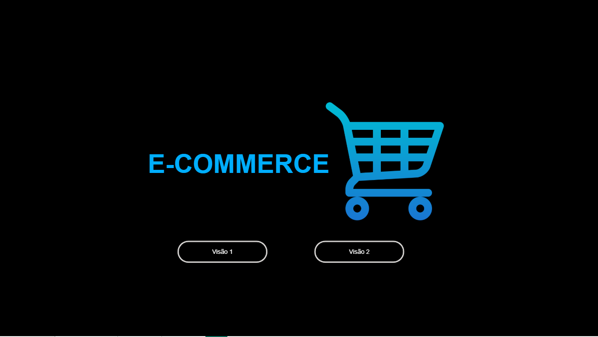
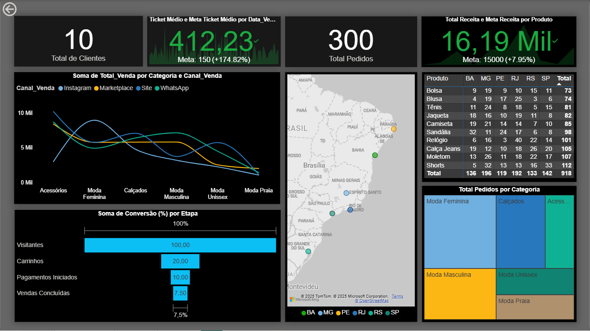
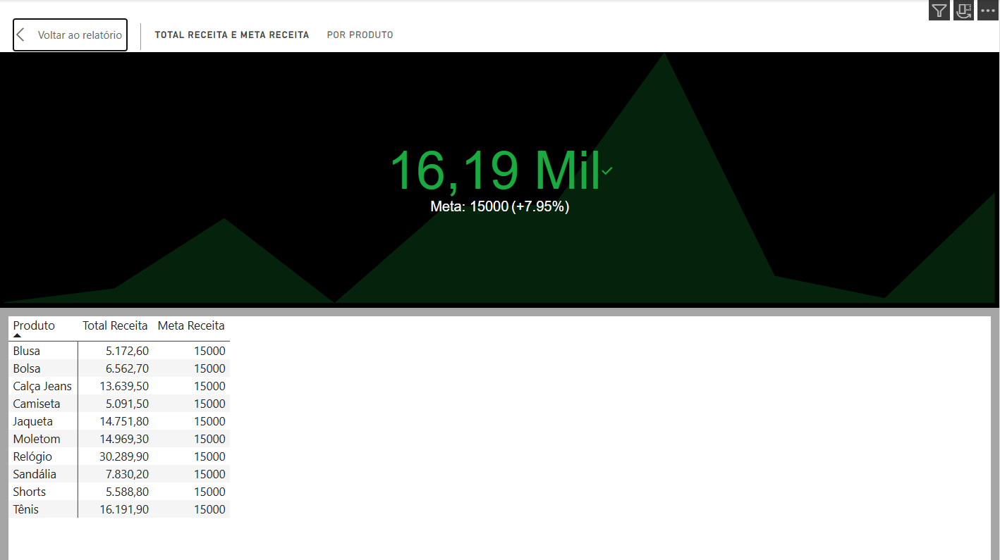

# Dashboard de E-commerce – Power BI

*Tema:* Loja online de roupas (dados fictícios)  
*Objetivo:* Praticar modelagem, visualização e análise de dados no Power BI.

---

## Questões Exploradas
- Onde estamos vendendo? (Mapa)  
- Qual a taxa de conversão? (Funil)  
- Quais categorias e canais performam mais? (Gráfico de linha)  
- Qual o volume de pedidos e clientes? (Cartões)  
- Qual a receita e a meta atual? (KPI)  
  
---

## Evolução do Projeto
- A *Visão 1* já está pronta com KPIs principais e análises gerais.  
- A *Visão 2* está em construção, onde pretendo incluir gráficos baseados em uma tabela calendário (como top 5 produtos mais vendidos por período).  

---

## 🖼️ Prints do Dashboard

  
  

---

✍️ Este projeto marca um avanço importante na minha jornada de transição para a área de dados. Ainda há muito por vir e estou animada com os próximos desafios! 😄
